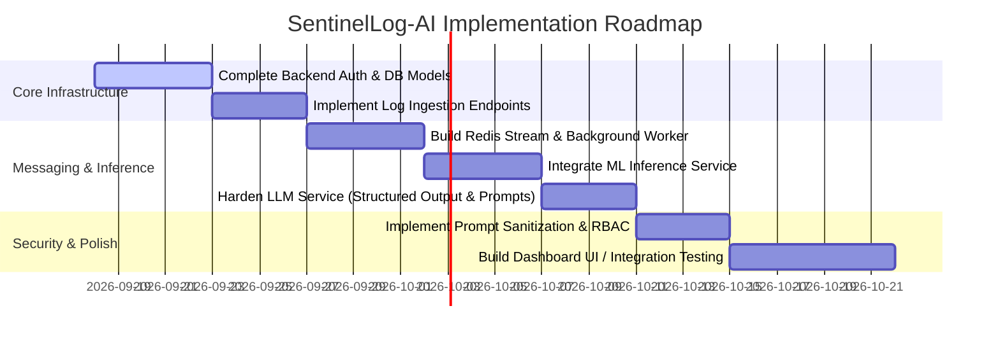

Listed directory SentinelLog-AI
Listed directory Docs
Viewed Introduction.md
Viewed design.md:1-154
Viewed system-design.md:1-637
Listed directory llm-Docs
Viewed Readme.md:1-68
Viewed design.md:1-7
Listed directory authentication
Viewed plan.md:1-12
Listed directory backend
Listed directory app
Listed directory core
Listed directory modules
Listed directory llm-services
Listed directory ai-model
Viewed main.py:1-8
Viewed config.py:1-21
Viewed security.py:1-31
Viewed api.py:1-75
Listed directory auth
Viewed schemas.py:1-13
Viewed promt.py:1-34
Viewed database.py:1-13

# Project Review & Executive Audit Summary: SentinelLog-AI

---

## 1. Project Summary & Architecture Overview

**SentinelLog-AI** is a multi-tenant, AI-assisted Security Information and Event Management (SIEM) log analysis platform built around a tiered processing strategy:

1. **High-Volume Ingestion**: Ingests security/system logs via a FastAPI application, queuing them into Redis Streams.
2. **First-Stage ML Filtering**: Background consumers pass raw logs through low-latency ML models (hosted separately or run in workers) to classify events as `LOW`, `MEDIUM`, or `HIGH` risk.
3. **Second-Stage LLM Deep Analysis**: Only high-risk anomalies escape the ML tier and reach the LLM tier (`llm-services`), where an LLM (such as Qwen2.5-72B via Hugging Face Inference API) produces explainable threat analyses, attack classifications, and MITRE ATT&CK mappings.
4. **Advisory Action & Storage**: Results are stored in PostgreSQL for viewing via an Electron/React UI dashboard, ensuring human-in-the-loop review before taking operational action.

---

## 2. Implemented Code Quality Assessment

| Component           | Status                        | Code Quality Rating   | Observations                                                                                                                                                                    |
| :------------------ | :---------------------------- | :-------------------- | :------------------------------------------------------------------------------------------------------------------------------------------------------------------------------ |
| **`Docs/`**         | Completed Architecture Design | **High (Conceptual)** | Clear Mermaid diagrams, well-structured SRS, clean pipeline design (ML tier before LLM tier).                                                                                   |
| **`llm-services/`** | Functional Prototype          | **Moderate**          | Basic FastAPI microservice returning LLM outputs (`Qwen/Qwen2.5-72B-Instruct`). Uses `huggingface_hub.InferenceClient`. Missing LangChain integration promised in requirements. |
| **`backend/`**      | Skeleton / Boilerplate        | **Low to Moderate**   | Core setup present (`security.py`, `database.py`, `config.py`), but module endpoints (`auth`, `admin`, `log`, `organization`) contain empty stub files (`0` bytes).             |
| **`ai-model/`**     | Exploration / Research        | **Low (Incomplete)**  | Directory contains experimental test folders (`test-models-1`, `test-models-2`) without a unified inference API or integration layer.                                           |

---

## 3. Project Completion Percentage

**Estimated Completion: ~20% - 25%**

- **Architecture & Documentation**: ~80% complete (`system-design.md`, database schema specs, flowcharts).
- **LLM Analysis Microservice (`llm-services`)**: ~60% complete (Inference endpoint working, needs structured JSON parsing, robust error handling, and prompt template validation).
- **Backend API (`backend`)**: ~15% complete (Security utilities and DB connection configured; routers, models, migrations, and CRUD logic missing).
- **ML Model Tier (`ai-model`)**: ~10% complete (Exploratory models exist; integration endpoints/workers missing).
- **Redis Queue & Async Workers**: 0% complete (Not yet implemented in backend).
- **Frontend Application**: 0% complete (Electron/React interface not created).

---

## 4. Security Assessment & Flaw Identification

> [!WARNING]
> The following security considerations were identified in the codebase and configuration:

1. **In-Code / Missing Environment Variable Fallbacks**:
   - In `llm-services/api.py`, `client.chat.completions` in the health check checks `HUGGINGFACE_API_KEY` but passes `os.getenv("HF_TOKEN")` (variable name mismatch).
   - If `HF_TOKEN` is missing, API calls will fail with unhandled exceptions.

2. **Database & Secret Management**:
   - `backend/app/core/config.py` relies directly on `os.getenv` without default fallbacks or strict validation, which could crash the container on missing environment variables.
   - Standard hardening practices (storing secrets in environment vaults, mandatory token expiration validation) should be strictly enforced.

3. **Prompt injection / Input Sanitization**:
   - `llm-services/promt.py` injects untrusted log content directly into the user prompt string without escaping or wrapping in clear boundary markers. An attacker could craft a malicious log message attempting to instruct the model to ignore prior directives.

4. **Error Traceback Leakage**:
   - `llm-services/api.py` returns `detail=f"LLM connection failed: {str(e)}"` and `detail=f"Failed to process {e}"`. Raw exception strings can leak internal system paths or third-party service details to clients.

5. **LLM Output Reliance**:
   - Architecture documentation correctly notes that LLM output must be treated as advisory. Ensure no automated execution actions are attached directly to LLM outputs without human verification.

---

## 5. Prioritized Task List (Roadmap)

### Priority 1: Backend Foundation (High Priority)

1. **Implement Database Schemas**: Build SQLAlchemy async models for `Organization`, `User/Admin`, `Log`, and `LLMExplanation`.
2. **Complete Authentication Module**: Fill out `backend/app/modules/auth/` (`api.py`, `service.py`, `dependencies.py`) with JWT login, bcrypt/Argon2 password hashing, and token auto-refresh logic.

### Priority 2: Ingestion & Pipeline Orchestration (High Priority)

3. **Log Ingestion Endpoint**: Implement `/api/v1/logs` endpoint in backend to receive, validate, and publish log entries to Redis.
4. **Redis Queue & Worker Loop**: Implement Redis Stream consumers to route incoming logs to ML inference models.

### Priority 3: LLM Service Hardening & LangChain Integration (Medium Priority)

5. **Fix Token Variable Mismatch**: Align `HF_TOKEN` across `health` and `analyze` endpoints in `llm-services/api.py`.
6. **Structured LLM Output**: Enforce structured Pydantic outputs using LangChain output parsers or Qwen JSON schema enforcement.
7. **Prompt Guardrails**: Implement prompt boundary wrapping and input sanitization to safeguard against prompt injection.

### Priority 4: ML Model Integration & Frontend (Medium to Low Priority)

8. **Containerize ML Service**: Wrap ML models (`ai-model`) into a clean REST API (e.g., FastAPI wrapper) for classification (`LOW`, `MEDIUM`, `HIGH`).
9. **Build Security Dashboard UI**: Develop the Electron/React presentation layer to view security events, ML risk scores, and LLM threat explanations.
