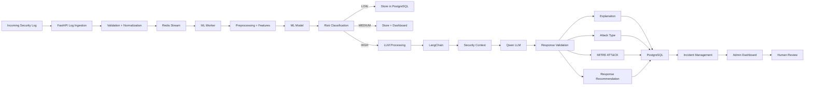
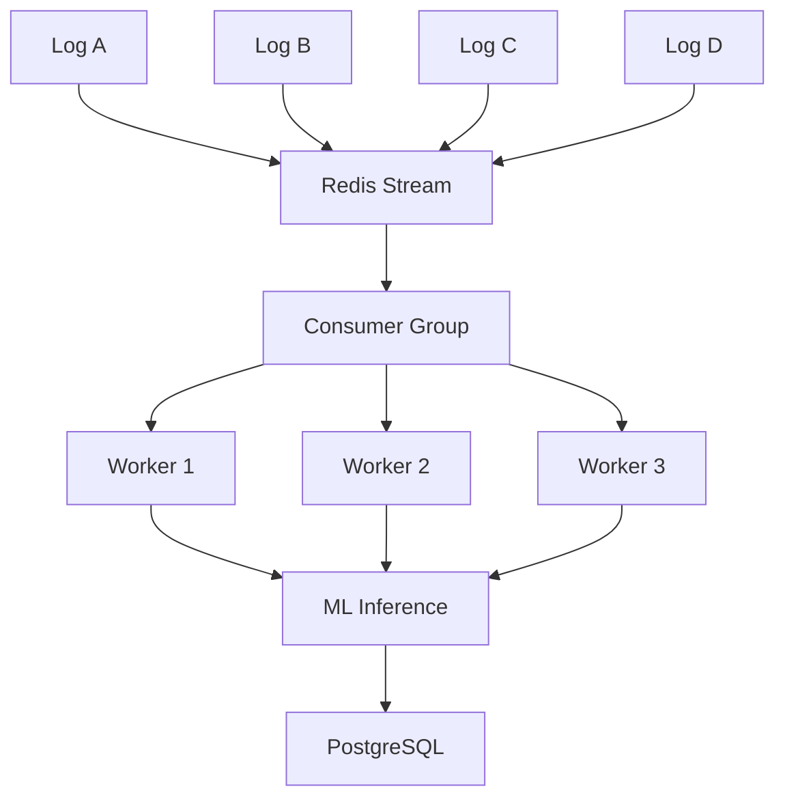

Absolutely. Based on your abstract and the stricter architecture we just established, this is the **system-level architecture** I would use for the SRS.

It separates **Frontend, Backend functional modules, Redis processing, ML inference, LLM/LangChain, PostgreSQL, and security controls**, while preserving your central principle: **ML processes the high-volume stream first; only high-risk events reach the LLM.**

```mermaid
flowchart TB

%% =========================================================
%% CLIENT LAYER
%% =========================================================

subgraph CLIENT["CLIENT / PRESENTATION LAYER"]
    ADMIN["Administrator"]
    
    subgraph ELECTRON["Electron Desktop Application"]
        REACT["React UI"]
        
        subgraph DASHBOARD["Security Dashboard"]
            OVERVIEW["Security Overview"]
            LOGVIEW["Log / Event Viewer"]
            INCIDENTVIEW["Incident Viewer"]
            MITREVIEW["MITRE ATT&CK View"]
            ANALYSISVIEW["AI Analysis View"]
            RESPONSEVIEW["Response Recommendation"]
        end
    end
end


%% =========================================================
%% API / BACKEND LAYER
%% =========================================================

subgraph BACKEND["BACKEND - PYTHON / FASTAPI"]

    MAIN["main.py
    FastAPI Application
    API Registration"]

    subgraph API["API LAYER"]
        AUTHAPI["Auth API
        /api/v1/auth"]
        
        LOGAPI["Log API
        /api/v1/logs"]
        
        INCIDENTAPI["Incident API
        /api/v1/incidents"]
        
        ANALYSISAPI["Analysis API
        /api/v1/analysis"]
        
        HEALTHAPI["Health API
        /api/v1/health"]
    end

    subgraph AUTH["AUTHENTICATION MODULE"]
        LOGIN["Admin Login"]
        VERIFY["Password Verification"]
        HASH["Password Hash
        Argon2id / bcrypt"]
        JWT["JWT Access Token"]
        RBAC["Authorization
        Admin Role"]
    end

    subgraph LOGMODULE["LOG INGESTION MODULE"]
        VALIDATE["Input Validation"]
        NORMALIZE["Log Normalization"]
        EVENTID["Event ID Generation"]
        METADATA["Event Metadata"]
    end

    subgraph ANALYSIS["ANALYSIS / ORCHESTRATION MODULE"]
        ROUTER["Analysis Router"]
        SERVICE["Analysis Service"]
        STATUS["Processing Status"]
        CORRELATION["Event Correlation"]
        RISK["Risk Decision"]
    end

    subgraph INCIDENT["INCIDENT MANAGEMENT MODULE"]
        INCIDENTSERVICE["Incident Service"]
        INCIDENTREPO["Incident Repository"]
        REVIEW["Admin Review"]
        APPROVE["Approve"]
        REJECT["Reject"]
        AUDIT["Audit Logging"]
    end

    subgraph CONFIG["CONFIGURATION"]
        SETTINGS["Environment Configuration"]
        SECRETS["Secrets / API Keys"]
    end
end


%% =========================================================
%% REDIS LAYER
%% =========================================================

subgraph REDIS["REDIS PROCESSING LAYER"]

    STREAM["Redis Stream
    security_logs"]

    GROUP["Consumer Group"]

    MLQUEUE["ML Processing
    Consumer"]

    LLMQUEUE["LLM Processing
    Consumer"]

    RETENTION["Stream Retention /
    Acknowledgement"]

    RETRY["Retry / Failed
    Processing"]
end


%% =========================================================
%% ML LAYER
%% =========================================================

subgraph ML["AI MODEL - MACHINE LEARNING LAYER"]

    PREPROCESS["Preprocessing"]

    FEATURES["Feature Extraction"]

    MODEL["Trained ML Model"]

    PREDICT["Inference / Prediction"]

    SCORE["Risk Score"]

    CLASSIFY["Risk Classification
    LOW / MEDIUM / HIGH"]

    MODELREG["Model Version /
    Model Artifact"]
end


%% =========================================================
%% LLM LAYER
%% =========================================================

subgraph LLM["LLM ANALYSIS LAYER"]

    LANGCHAIN["LangChain
    Orchestration"]

    PROMPT["Prompt Construction"]

    CONTEXT["Security Context
    + Related Events"]

    QWEN["Qwen API / LLM"]

    PARSE["LLM Response Parser"]

    EXPLANATION["Incident Explanation"]

    ATTACK["Potential Attack Type"]

    MITRE["MITRE ATT&CK
    Mapping"]

    RECOMMEND["Recommended
    Response"]

    LLMVALIDATE["Output Validation"]
end


%% =========================================================
%% DATABASE LAYER
%% =========================================================

subgraph DATABASE["PERSISTENCE LAYER"]

    PG["PostgreSQL"]

    subgraph TABLES["PostgreSQL Data"]
        USERS["Admin / User"]
        EVENTS["Security Events"]
        MLRESULT["ML Analysis Results"]
        INCIDENTS["Incidents"]
        LLMRESULT["LLM Analysis"]
        ATTACKS["Attack Classifications"]
        MITRETABLE["MITRE Mappings"]
        RESPONSES["Response Recommendations"]
        AUDITTABLE["Audit Logs"]
    end

    ALEMBIC["Alembic
    Database Migrations"]
end


%% =========================================================
%% SECURITY CONTROLS
%% =========================================================

subgraph SECURITY["SECURITY CONTROLS"]

    TLS["TLS / HTTPS"]

    INPUTSEC["Input Validation"]

    RATE["Rate Limiting"]

    APISEC["API Authentication"]

    LOGSEC["Secure Log Handling"]

    PROMPTSEC["Prompt Injection
    Protection"]

    OUTPUTSEC["LLM Output Validation"]

    SECRETSEC["Secret Protection"]

    AUDITSEC["Security Audit Trail"]

    LEAST["Least Privilege"]
end


%% =========================================================
%% INFRASTRUCTURE
%% =========================================================

subgraph INFRA["DEPLOYMENT / INFRASTRUCTURE"]

    DOCKER["Docker / Docker Compose"]

    BACKENDCONT["FastAPI Container"]

    REDISCONT["Redis Container"]

    PGCONT["PostgreSQL Container"]

    WORKER["Background Worker"]

    ENV["Environment Variables"]
end


%% =========================================================
%% FRONTEND FLOW
%% =========================================================

ADMIN --> REACT

REACT --> OVERVIEW
REACT --> LOGVIEW
REACT --> INCIDENTVIEW
REACT --> MITREVIEW
REACT --> ANALYSISVIEW
REACT --> RESPONSEVIEW

REACT -->|HTTPS| MAIN


%% =========================================================
%% FASTAPI REGISTRATION
%% =========================================================

MAIN --> AUTHAPI
MAIN --> LOGAPI
MAIN --> INCIDENTAPI
MAIN --> ANALYSISAPI
MAIN --> HEALTHAPI


%% =========================================================
%% AUTHENTICATION FLOW
%% =========================================================

AUTHAPI --> LOGIN
LOGIN --> VERIFY
VERIFY --> HASH
VERIFY --> JWT
JWT --> RBAC

RBAC --> APISEC

APISEC --> LOGAPI
APISEC --> INCIDENTAPI
APISEC --> ANALYSISAPI


%% =========================================================
%% LOG INGESTION FLOW
%% =========================================================

LOGAPI --> VALIDATE
VALIDATE --> NORMALIZE
NORMALIZE --> EVENTID
EVENTID --> METADATA
METADATA --> STREAM


%% =========================================================
%% REDIS FLOW
%% =========================================================

STREAM --> GROUP
GROUP --> MLQUEUE

MLQUEUE --> PREPROCESS

STREAM --> RETENTION
MLQUEUE --> RETRY


%% =========================================================
%% ML PIPELINE
%% =========================================================

PREPROCESS --> FEATURES
FEATURES --> MODEL
MODEL --> PREDICT
PREDICT --> SCORE
SCORE --> CLASSIFY

MODELREG --> MODEL

CLASSIFY --> RISK


%% =========================================================
%% RISK ROUTING
%% =========================================================

RISK -->|LOW| LOWSTORE["Store Low-Risk Result"]
RISK -->|MEDIUM| MEDSTORE["Store Medium-Risk Result"]
RISK -->|HIGH| HIGHROUTE["High-Risk Event"]

LOWSTORE --> PG
MEDSTORE --> PG

HIGHROUTE --> CORRELATION
CORRELATION --> LLMQUEUE


%% =========================================================
%% LLM PIPELINE
%% =========================================================

LLMQUEUE --> CONTEXT
CONTEXT --> LANGCHAIN
LANGCHAIN --> PROMPT
PROMPT --> QWEN

QWEN --> PARSE
PARSE --> LLMVALIDATE

LLMVALIDATE --> EXPLANATION
LLMVALIDATE --> ATTACK
LLMVALIDATE --> MITRE
LLMVALIDATE --> RECOMMEND

EXPLANATION --> PG
ATTACK --> PG
MITRE --> PG
RECOMMEND --> PG


%% =========================================================
%% INCIDENT MANAGEMENT
%% =========================================================

PG --> INCIDENTSERVICE

INCIDENTSERVICE --> INCIDENTREPO
INCIDENTREPO --> INCIDENTS

INCIDENTS --> REVIEW

REVIEW --> APPROVE
REVIEW --> REJECT

APPROVE --> AUDIT
REJECT --> AUDIT

AUDIT --> AUDITTABLE


%% =========================================================
%% ANALYSIS API
%% =========================================================

ANALYSISAPI --> ROUTER
ROUTER --> SERVICE
SERVICE --> STATUS
SERVICE --> PG


%% =========================================================
%% DATABASE CONNECTION
%% =========================================================

subgraph DBACCESS["DATABASE ACCESS"]
    DBCONN["database.py
    PostgreSQL Connection"]
    SESSION["SQLAlchemy
    Session"]
    REPOSITORY["Repository Layer"]
end

DBCONN --> SESSION
SESSION --> REPOSITORY
REPOSITORY --> PG

ALEMBIC --> PG

EVENTS --> PG
MLRESULT --> PG
INCIDENTS --> PG
LLMRESULT --> PG
ATTACKS --> PG
MITRETABLE --> PG
RESPONSES --> PG


%% =========================================================
%% SECURITY FLOW
%% =========================================================

TLS --> MAIN
INPUTSEC --> VALIDATE
RATE --> MAIN
LOGSEC --> NORMALIZE
PROMPTSEC --> PROMPT
OUTPUTSEC --> LLMVALIDATE
SECRETSEC --> SECRETS
SECRETS --> SETTINGS
LEAST --> PG
LEAST --> REDIS


%% =========================================================
%% INFRASTRUCTURE
%% =========================================================

DOCKER --> BACKENDCONT
DOCKER --> REDISCONT
DOCKER --> PGCONT

BACKENDCONT --> MAIN
REDISCONT --> STREAM
PGCONT --> PG

WORKER --> MLQUEUE
WORKER --> LLMQUEUE

ENV --> SETTINGS
```



## The most important flow in the entire architecture

For your SRS, this is the **core processing pipeline**:



### Why this architecture matches your abstract

Your abstract's central claim is:

```text
Massive Logs
     ↓
     ML
     ↓
Filter / Prioritize
     ↓
Only suspicious events
     ↓
    LLM
     ↓
Deep analysis
```

That is exactly what the architecture implements.

The **critical design principle** is therefore:

> **The LLM must not be in the normal log-ingestion path.**

A normal log should be able to travel:

```text
Log → FastAPI → Redis → ML → PostgreSQL
```

without ever touching Qwen.

A high-risk log travels:

```text
Log → FastAPI → Redis → ML → HIGH
                              ↓
                           LangChain
                              ↓
                           Qwen LLM
                              ↓
                  MITRE + Explanation + Recommendation
                              ↓
                         PostgreSQL
```

That is the architectural feature that makes SentinelLog AI different from simply building an "LLM-based log analyzer."

---

## One correction to your original Redis idea

Don't model Redis as:

```text
Log A → Redis A
Log B → Redis B
Log C → Redis C
```

Instead:



This gives you **concurrency without creating unnecessary Redis instances**.

Also, don't describe Redis in the SRS as simply "freeing space after analysis." Describe it in terms of **stream processing, consumer groups, acknowledgement, retention, retry handling, and backpressure**. That is much more technically accurate.

---

## Recommended backend folder mapping

The architecture above maps cleanly to:

```text
backend/
│
├── main.py
│
├── database/
│   ├── database.py
│   ├── models.py
│   └── migrations/
│
├── redis/
│   ├── client.py
│   ├── streams.py
│   └── consumer.py
│
├── modules/
│   ├── auth/
│   ├── logs/
│   ├── analysis/
│   └── incidents/
│
├── ai_model/
│   ├── preprocessing/
│   ├── features/
│   ├── inference/
│   └── model/
│
└── llm/
    ├── langchain/
    ├── qwen/
    ├── prompts/
    ├── mitre/
    └── validation/
```

One final architectural rule I would put into the SRS:

> **No LLM-generated output shall directly execute a security action. LLM output shall be treated as advisory and shall require validation and, where applicable, administrator approval before any response action is performed.**

That is an important security boundary for this project.
